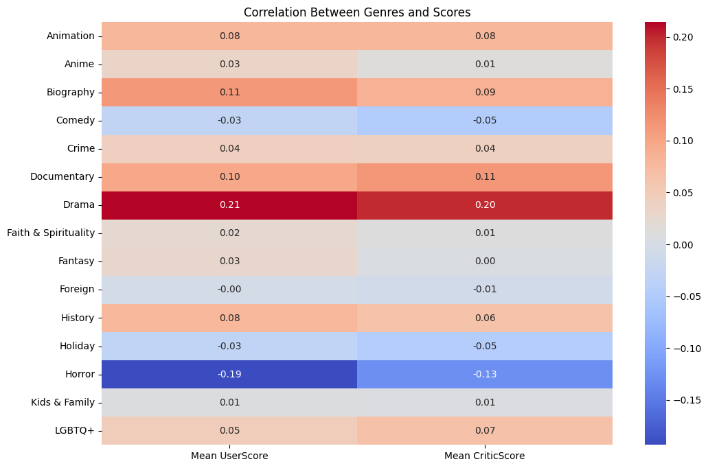
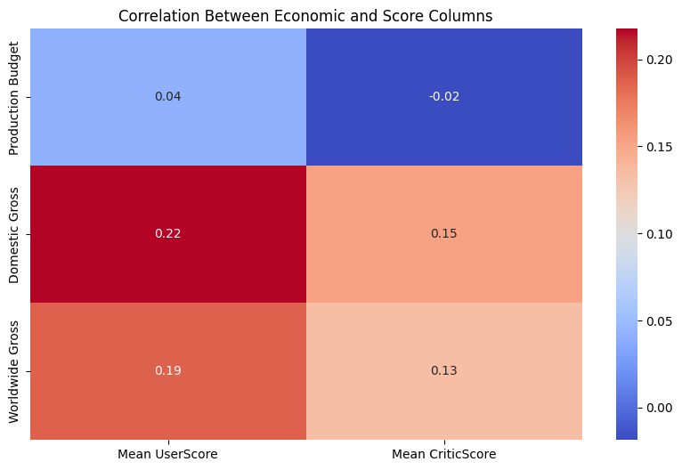
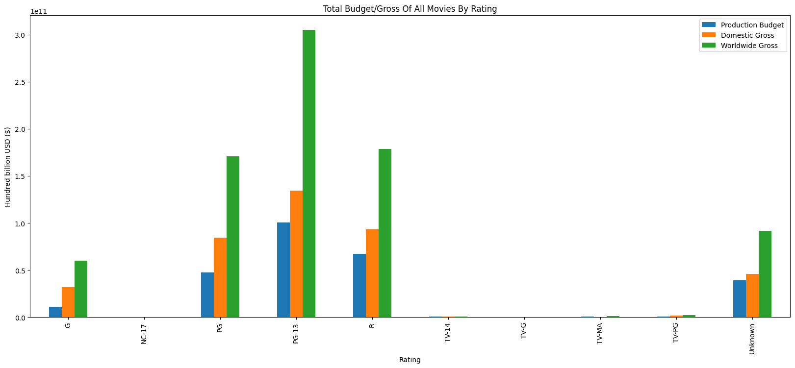
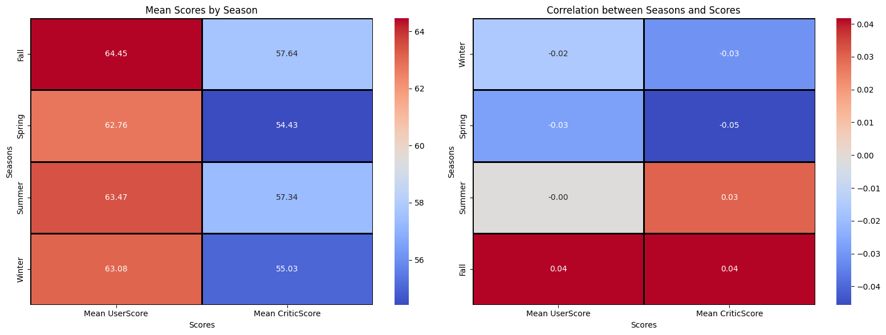
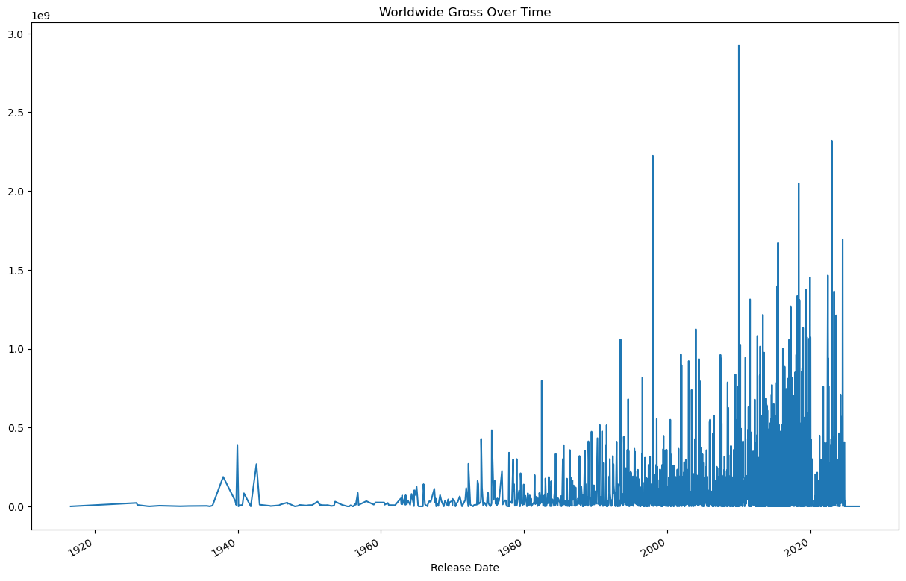
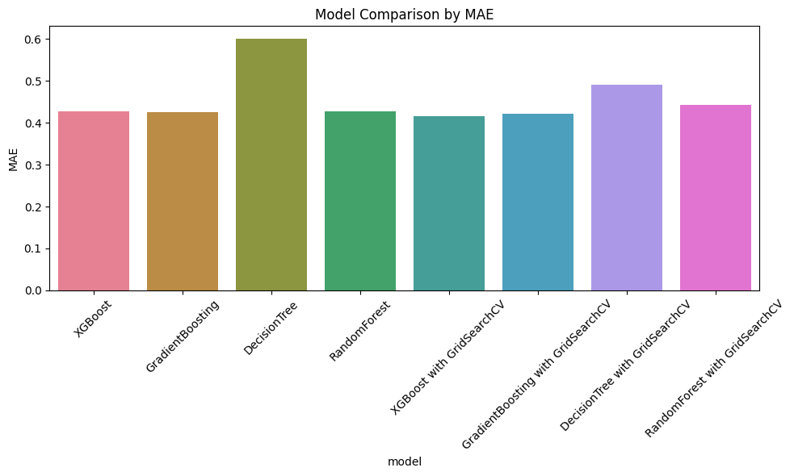
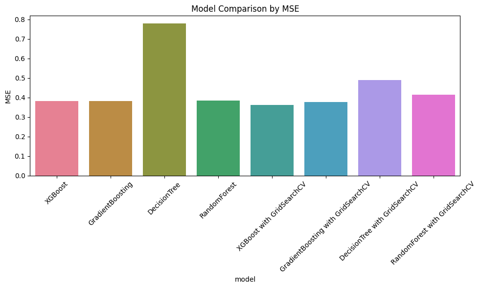
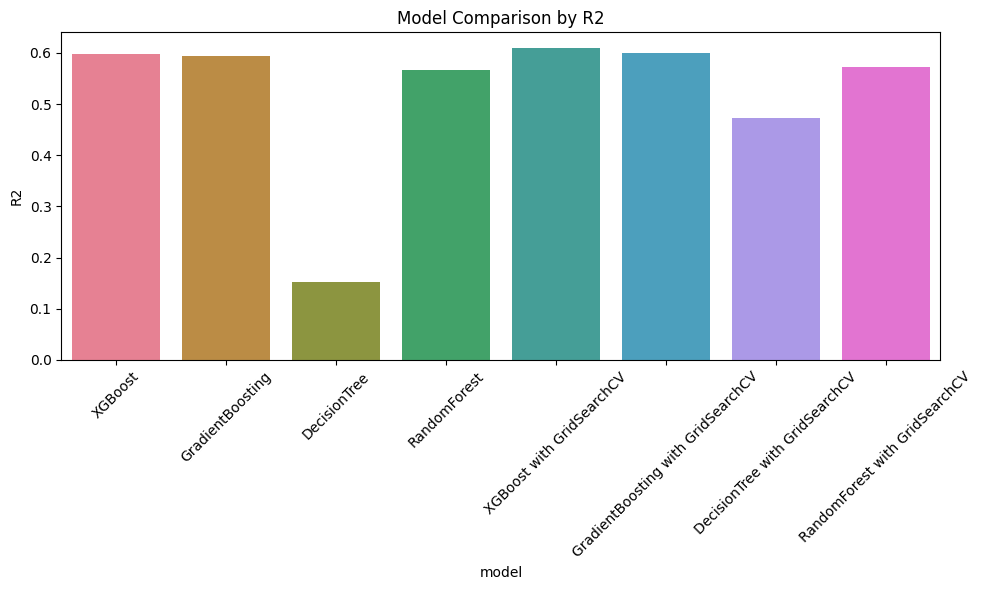

# 🎬 Intro2DS---HCMUS---2024  
## 📘 Introduction to Data Science Project – Final Report

<table>
    <tr>
        <th>ID</th>
        <th>NAME</th>
    </tr>
    <tr>
        <td>22127148</td>
        <td>Dương Nhật Huy</td>
    </tr>
    <tr>
        <td>22127224</td>
        <td>Trương Thuận Kiệt</td>
    </tr>
    <tr>
        <td>22127257</td>
        <td>Phạm Minh Mẫn</td>
    </tr>
    <tr>
        <td>22127492</td>
        <td>Hồ Đăng Phúc</td>
    </tr>
</table>

---

## 📌 1. Project Overview

This project was developed as the final assignment for the *Introduction to Data Science* course at HCMUS. Our team chose to work on a dataset related to movies, containing diverse attributes such as ratings, cast, budget, gross income, and genre. 


The main goals of the project were:
- To perform **exploratory data analysis (EDA)** and uncover insights into the film industry.
- To **build machine learning models** that can predict **worldwide gross revenue**.
- To **answer specific business questions** using statistical methods and visualizations.

We structured our work around the core phases of the CRISP-DM methodology, from understanding the data to building and evaluating predictive models.

---

## ⚙️ 2. Tools and technologies
- The technologies and tools used were Python (Pandas, Numpy, Matplotlib, Seaborn, Scikit-Learn, XGBoost, Gradient Boosting), Jupyter Notebook, Git and Github (version control), machine learning classification algorithms, statistics, Anaconda (terminal) and Visual Studio Code (project development environment).

--- 

## 🎯 3. Business Problem and Objective

### 3.1 Business Problem  
Movie producers and studios often face uncertainty when estimating a movie’s potential success. Understanding the key factors that drive movie performance helps reduce financial risk and improve strategic planning.

### 3.2 Objectives  
1. Analyze key drivers of a movie’s revenue and rating success.  
2. Develop regression models to **predict total gross**.  
3. Use data science to assist decision-making in budgeting, casting, and marketing.

---

## 🗃️ 4. Dataset Description
### Data Collection

#### 1. The Numbers
- **Website**: [The Numbers](https://www.the-numbers.com/)
- **Purpose**: To collect movie budget and revenue data.
- **Steps**:
  1. Use `requests` to send GET requests to paginated URLs (e.g., `https://www.the-numbers.com/movie/budgets/all/{page_number}`).
  2. Parse the HTML response using `BeautifulSoup`.
  3. Extract data from the table, including:
     - Release Date
     - Movie Name
     - Production Budget
     - Domestic Gross
     - Worldwide Gross
  4. Iterate through all pages to collect data.

#### 2. Rotten Tomatoes
- **Website**: [Rotten Tomatoes](https://www.rottentomatoes.com/)
- **Purpose**: To collect movie details such as title, critic score, user score, cast, director, genre, and more.
- **Steps**:
  1. Use `requests_html` to render JavaScript-based pages.
  2. Parse the rendered HTML using `BeautifulSoup`.
  3. Extract movie details from editorial pages and follow links to individual movie pages for additional data.
  4. Handle missing data (e.g., movies without user scores).

#### 3. Metacritic
- **Website**: [Metacritic](https://www.metacritic.com/)
- **Purpose**: To collect additional scores (Metascore and User Score) for movies.
- **Steps**:
  1. Format movie titles to generate URLs (e.g., replace spaces with `-`, remove special characters).
  2. Use `requests` with a `User-Agent` header to mimic a browser.
  3. Parse the HTML response using `BeautifulSoup`.
  4. Extract Metascore and User Score from specific HTML elements.
  5. Log failed movies for later recrawling.
  6. Save the data into a CSV file (`results.csv`).

#### 4. Investopedia (Inflation Data)
- **Website**: [Investopedia](https://www.investopedia.com/)
- **Purpose**: To collect historical inflation rates for adjusting financial data (e.g., budgets, grosses).
- **Steps**:
  1. Use `requests` with a `User-Agent` header to bypass web protection.
  2. Parse the HTML response using `BeautifulSoup`.
  3. Extract inflation rates from the table.
  4. Calculate inflation-adjusted units for each year using the formula:
     - $U_n = U_{n-1} \times (1 + \frac{r}{100})$
  5. Save the data into a CSV file (`inflation_rate.csv`).

### Data Information
The dataset was compiled from multiple sources and contains the following key features:

- 🎞️ `Title`, `Cast`, `Director`, `Genre`, `Studio`, `PlatformReleased`, `Rating`  
- 📅 `Release Date`, `Runtime`  
- 💰 `Production Budget`, `Domestic Gross`, `Worldwide Gross`  
- ⭐ `CriticScore`, `UserScore`  

The dataset provides both numerical and categorical attributes, enabling diverse types of analyses (correlation, regression, classification).

---

## 📊 5. Main Insights (from EDA)

1. **User scores and critic scores** have moderate correlation, but user preferences differ significantly by genre.


2. **Score** is a strong indicator of potential gross, but not all high-scoring films succeed.


3. Some **ratings** (like PG, R) tend to dominate box office revenue.


4. The **studio** and **release month** (seasonality) impact performance significantly.


5. There’s a visible revenue outlier group – massive hits skewing the data (e.g., blockbusters) and movie in recent years.

---

## 🤖 6. Modelling Approach

We applied the following:

To solve the regression task of predicting a movie’s Total Revenue, we followed a structured and iterative modelling workflow. This process included data preparation, model experimentation, evaluation, and selection of the most suitable algorithm. Below is a breakdown of the key steps:

### 🔧 6.1. Data Preparation
- **Target Variable**: `Total Gross = Worldwide Gross + Domestic Gross`

- **Feature Selection:**

    - Removed leakage variables (e.g., link, title).

    - Excluded high-cardinality categorical fields that couldn't be processed without external encoding (e.g., full cast names) unless engineered further.

    - Prioritized interpretable and numerical features such as Production Budget, CriticScore, UserScore, Runtime, and simplified categorical fields like Genre, Rating, and Studio.

- **Handling Missing Values:**

    - Numerical features were imputed using the KNN.

    - Categorical features were imputed using the hybrid approach combining filling by **similarity-based method** and **mode**.

- **Encoding:**

    - Used One-Hot Encoding for low-cardinality categorical features (Genre, Rating, etc.).

    - Used one hot for top values for high-cardinality categorical features (Cast, Director).

- **Feature Scaling:**

    - Applied StandardScaler to numerical variables (especially important for linear models).

- **Log Transformation:**

    - As revenue data is typically right-skewed, we applied np.log1p() to Total Gross to reduce skew and improve model performance.

### 🧪 6.2 Model Training & Comparison
We trained multiple regression models to evaluate which best captures the relationship between the predictors and the revenue.

Models tested:
- **Linear Regression (baseline model)**

- **XGBoost**

- **Random Forest Regressor**

- **Decision Tree Regressor**

- **Gradient Boosting Regressor**

Each model was trained using:

- Stratified k-Fold Cross-Validation (where applicable, based on revenue bins)

- **MAE**, **MSE** and **R² Score** as evaluation metrics

- **GridSearchCV** for hyperparameter tuning on advanced models

### 📊 6.3 Evaluation Metrics

#### 🧪 Evaluation:
We evaluated models using:
- **MAE (Mean Absolute Error)**


- **MSE**


- **R² Score**


The **XGB model (after hyperutned)** performed best, balancing both bias and variance, and showed strong predictive capability on test data.

---

## 🗂️ 7. Project Structure


## Project Structure:
- **Data/**: Contains the datasets used in the project.
- **Data_Collection/**: Scripts and notebooks for data collection from various sources.
- **Data_Exploration/**: Jupyter notebooks with exploratory data analysis.
- **Data_Modelling/**: Jupyter notebooks with model training and evaluation.
- **Data_Preprocessing/**: Scripts and notebooks for data preprocessing and feature engineering.
- **Questions/**: Contains questions and analysis related to the project.
- **Reflection/**: Contains reflections and learnings from the project.
- **README.md**: Project documentation.

## Setup Instructions:
1. Clone the repository:
    ```sh
    git clone https://github.com/truongthuankiet1990gmailcom/Intro2DS---HCMUS---2024.git
    ```
2. Navigate to the project directory:
    ```sh
    cd Intro2DS-HCMUS-2024
    ```
3. Choose the appropriate kernel.

## Usage:
- To run the notebooks:
    + Open the notebook in Jupyter and press `Run All`.
    + If there are some libraries not included in your kernel, please run the command prompt and write `pip install required-library`.

## Project Management:
- We are using Microsoft Planner for project management. You can track our progress and view our backlog on our [Microsoft Planner](https://planner.cloud.microsoft/webui/plan/CPAR6teeCE-pZBMR6o_p-sgAEG6v?tid=40127cd4-45f3-49a3-b05d-315a43a9f033).
